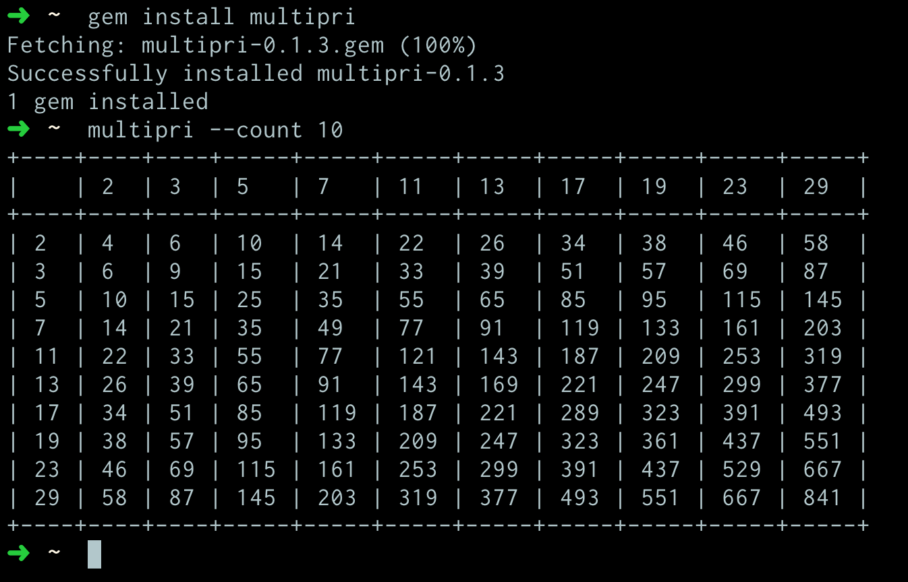

# Multipri: Prime Multiplication Table

Program that prints a multiplication table of primes numbers.
The program should takes an argument from the command line that specifies the amount of prime numbers to generate and print out a multiplication table for these prime numbers.

## Usage

1. Install the library with `gem install multipri`
2. Run it, passing in the table size: `multipri --count 5`

It will output a table similar to the following:

## Development

Run tests with `rspec`

